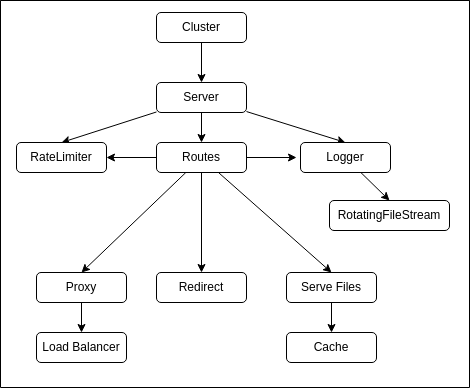

# DEDA Proxy Server Architecture

This document describes the software architecture of the Node Proxy Server package.




For an in-depth description of the architecture see [Architecture.md](./docs/Architecture.md).

## Component Drive Application

This application uses a very simple yet extremely customizable flat componentization architecture that uses JSON to build and load the application accordingly to the user needs/requirements.

The core module is a single class (`Component.js`) that is about 50 lines of code (without comments, ~200 with comments). All components extends this class and have a unique `namespace` that is registered with the parent class. The JSON definition uses the `namespace` to create components. For example:

```json
// Create an HTTP server listening on port 8080
{
    "namespace": "Server.HTTP",
    "port": 8080,
    "host": "0.0.0.0"
},
```

Or a more complex example would be:

```json
// Create a rate limiter That then creates a memory store to used as database.
{
    "id": "API.RateLimiter",
    "namespace": "RateLimit",

    "max": 10,
    "windowMs": 10000,
    "standardHeaders": false,

    "store": {
        "namespace": "Store.Memory"
    }
},
```

To summarize; the application implements many different components to fullfil different task and it is up to the user to put them together according to their needs. This makes it easier for developers to extend the functionality of the application and write new components.

### Clustering

The main application class `app.js` is the cluster/worker manager. This class spawns new threads and provides a mechanism for child processes to communicate between each other using Node IPC (Inter-Process Communication).

Using the JSON config you can create different forks of different configurations and share memory stores and file loggers. A simple example would be:

```json
// Define cluster configuration that spawns 4 workers the `app` configs
"cluster": {
    "numberOfWorkers": 4,
}

"app": {
    "components": [
        {
            "namespace": "Server.HTTP",
            "port": 8080,
            "host": "0.0.0.0"
        },
        {
            "namespace": "Server.HTTP",
            "port": 4443,
            "host": "0.0.0.0",
            "key" : "${env.cwd}/docs/www/ssl/private.key",
            "cert": "${env.cwd}/docs/www/ssl/cert.crt",
        }
    ]
}
```

A more complex example would be: Create 4 threads of the HTTP Proxy Server that uses another threads for access logging.

```json
"cluster": {
    // Create 4 threads using the `app` configurations and 1 thread using the `logger` configs.
    "workers": [
        {"name": "app", "count": 4 },
        {"name": "logger", "count": 1 }
    ],

    // Create a Memory store within the primary thread.
    "components": [
        {
            "id": "MemoryStore",
            "namespace": "Store.Memory"
        }
    ]
}
// Define the `app` configuration
"app" : {
    {
        "namespace": "Server.HTTP",
        "port": 8080,
        "host": "0.0.0.0"
    },
    // Create an HTTP Proxy to the Express that uses the logger with ID "DEDA-Logger" within the "logger" thread.
    {
        "namespace": "Proxy.HTTP",
        "loggerId": "logger.DEDA-Logger"
        "match": { "pathname": "//^/api/"},
        "upstream": [
            {"server": "https://192.168.0.200/"},
            {"server": "https://192.168.0.201/"},
            {"server": "https://192.168.0.202/", "down": true}
        ]
    }

}
// Define the `logger` configurations
"logger": {
    // Create a logger component with with ID "DEDA-Logger" and uses the "DEDA-LogStream" as the output stream.
    {
        "id": "DEDA-Logger",
        "namespace": "Logger",
        "format": " ... \n",
        "streamId": "DEDA-LogStream"
    },
    {
        "id": "DEDA-LogStream",
        "namespace": "Stream.RotatingFile",
        "size": "1M",
        "totalFile": 3,
        "path": "${env.cwd}/docs/www/logs/access.log"
    }
}

```


# Files

A quick reference to the files within the package. The order of the files indicates loading order. The hierarchy describes parent-child relations.

- **Cluster.js** - Used by the `main.js` file to start the server as a cluster based on the given configurations.
- **Server.js** - The main class that loads the configs and creates the services.
    - **Logger.js** - Logs http access to file.
        - **RotatingFileSystem.js** - Used by the logger to store the http access information.
    - **RateLimit.js** - Provides rate limit functionality to mitigate DDOS attaches.
    - **Route.js** - Used to route/proxy given HTTP requests based on matched URL. 
        - **Proxy.js** - Proxies a request to a different server. Support load-balancing.
        - **Redirect.js** - Redirects the matched request to a different URL.
        - **Serve.js** - Serves static files from a set directory.
            - **Cache.js** - Used as a fast memory cache to serve files.

Other helper and supporting files:

- **Mime.json** - A list of mime types used by `Serve.js` to serve static files.
- **Status.json** - A list of HTTP status codes and their messages used by `Serve.js` to serve static files.
- **Utility.js** - Provides static common helper methods.
- **Tools.js** - CLI tools to update `Mime.json` and `Status.json` files.